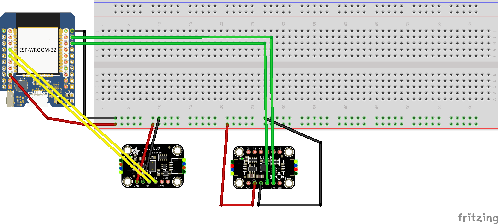

# Goalfinder System Documentation

## Summary

The Goalfinder is a device for visually impaired people, that need assistence locating the basket when playing basketball. This is done by a constant sound being played so that they can locate the basket. When a goal is scored a user specificated fanfare is played.

## Pin Configuration

### Components

- Distance Sensor
- Motion Sensor
- I2S Amp
- ESP 32